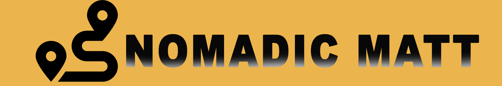
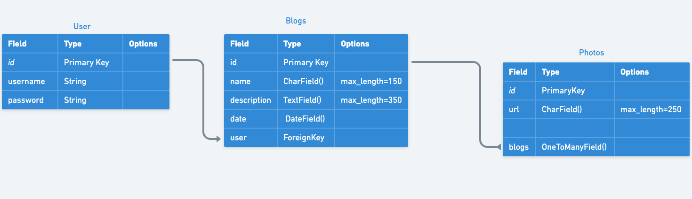
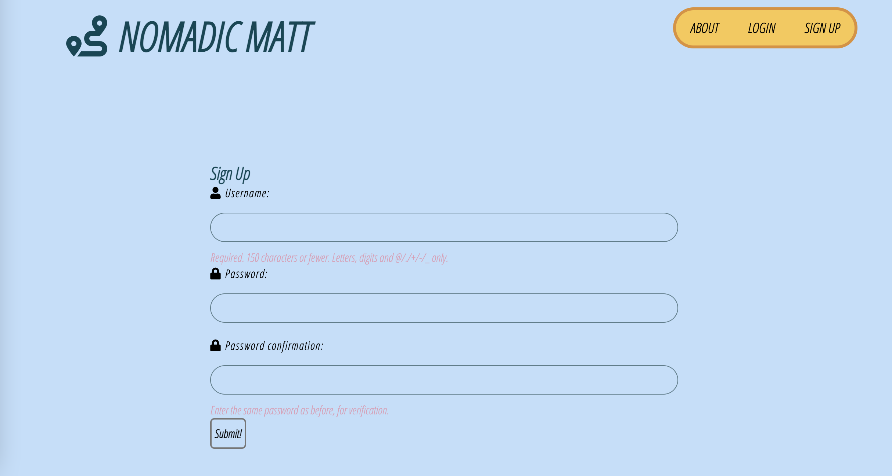
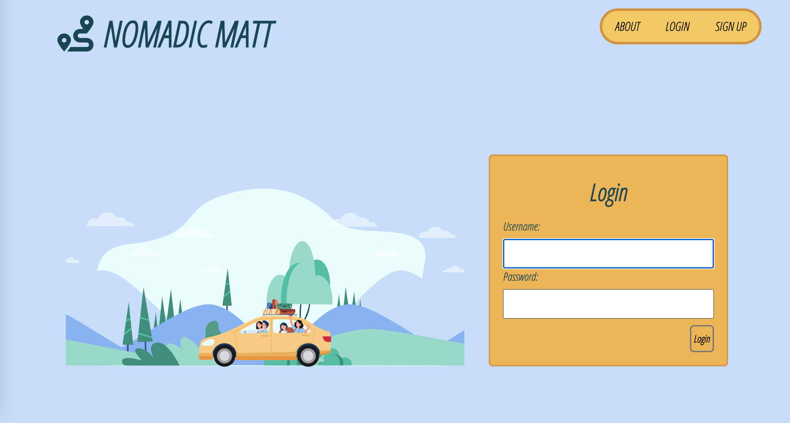
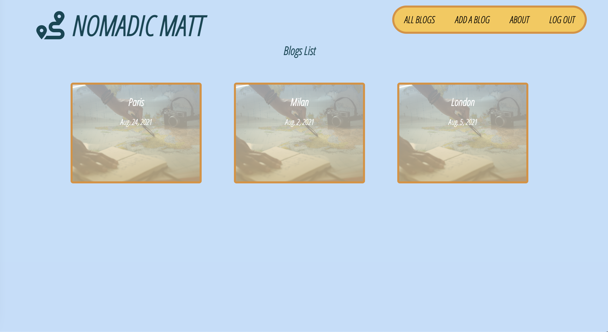
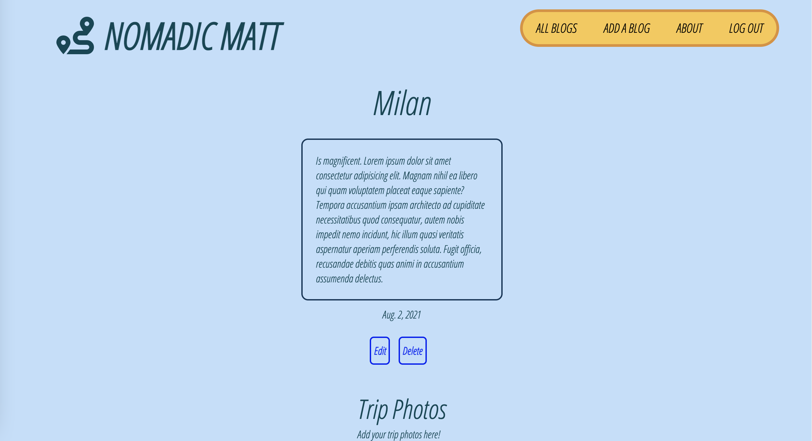
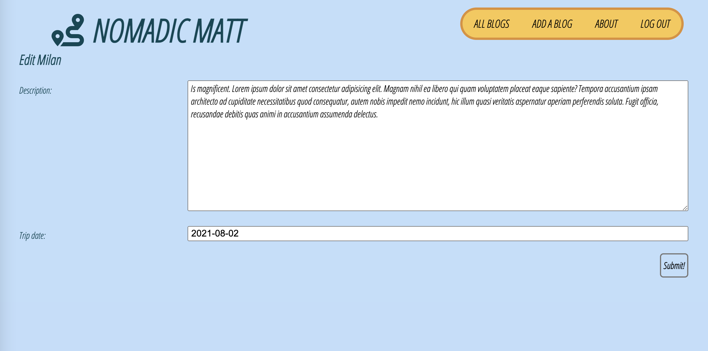
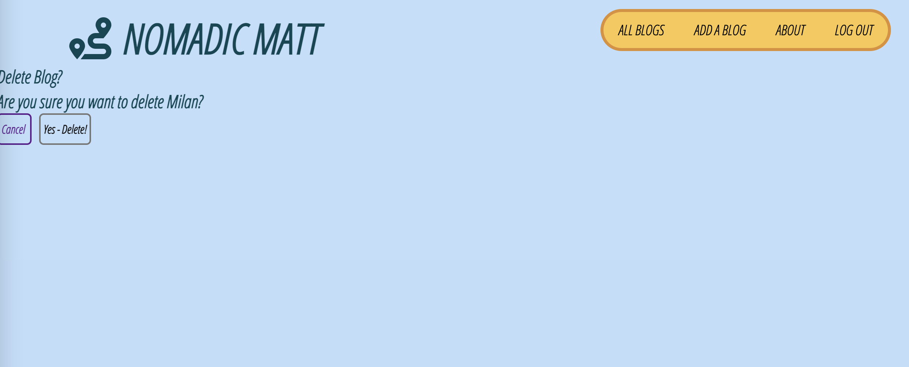

Nomadic Matt is an app for the person who can't sit in their chair for more than 5 minutes. The app is for all the curious cats of the world who dare to go on a mission and document it. 
Nomadic Matt is a blog for the user that is in love with traveling and wants to properly document it. Kinda like having an online journal. A user can create a blog for every place they visit. Even the kitchen for a late night snack, and document it! Or not... whatever. A user can edit their entries as well as delete them. A user can add and delete pictures as well. 

## Getting Started

>App Link:
- [Nomadic Matt](https://sjstravelblog.herokuapp.com/)

>Trello Board:
- [Trello](https://trello.com/b/DzsIG06x/sjtravels)

>Wireframes:
- [Wireframes](https://whimsical.com/sjtravels-wireframe-erd-Ecthbv1uKrsMkZuG1CTQpe)

#### ERD:

#### App Images:

#### Credit: Login Lottie Animation
- [lottiefiles](https://lottiefiles.com/46541-nature-visite-travel)
  

#### Technologies and sites used:
- Javascript
- CSS
- HTML
- Python
- Django
- Django auth
- Unsplash
- Google fonts
- Font Awesome
- lottiefiles.com

#### Next Steps:
- Styling improvements

